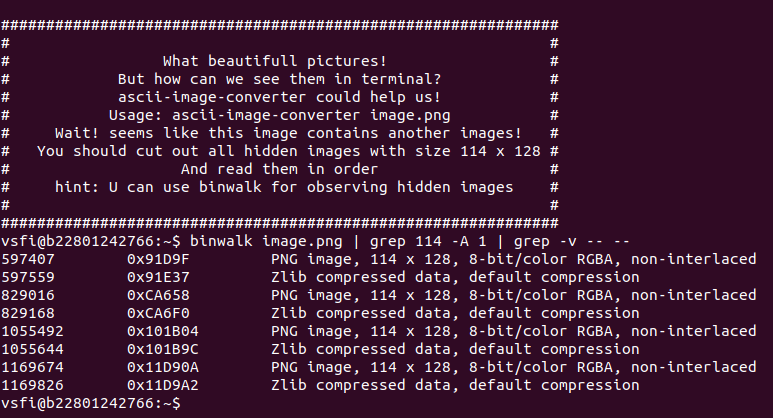

# ascii

The task is to find all the pictures 114x128 sized, cut and print them via `ascii-image-converter`

## Answer


## writeup

1. The input is `image.png`, which is merged images
1. Check signatures and addresses via `binwalk`
   
1. Cleanup output via `grep`, we should get start and end address for 114x128 pics
   
1. Get decimal addresses
   
1. Combine start and end addresses
   
1. The final part: interate over list and cut pictures via `dd`. Use counter to keep the correct order.

```
binwalk image.png | grep 114 -A 1 | grep -v -- -- | awk '{print $1}' | paste -d ' ' - - | while read number1 number2; do dd if=image.png of=flag$((counter++)).jpg bs=1 skip=$number1 count=$number2 status=none; done && ascii-image-converter flag*
```

## simplify

Turned out pics have the same size

```
binwalk image.png | grep 114 -A 1 | grep -v -- -- | awk '{print $1}' | paste -d '-' - - | bc
-152
-152
-152
-152
```

so you can use constant offset

```
binwalk image.png | grep 114 | awk '{print $1}' | xargs -I % bash -c 'dd if=image.png bs=1 skip=% count=$((%+152)) status=none | ascii-image-converter -'
```
